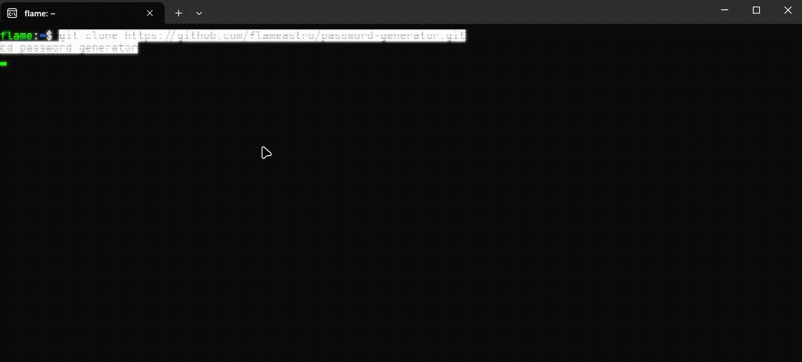

# 🔐 password-generator

A simple and secure password generator made with Python.



## 🧐 Why I created this

As time goes by, password-related attacks become increasingly common. Weak and reused passwords can put your accounts and personal information at risk.

That's why I created this tool: a simple way to generate strong and random passwords while browsing the web more safely.

## 🔑 About Password Managers

Password generators are useful, but they are only one part of good password security.

Using a password manager can help you securely store and manage unique passwords for each of your accounts. This way, you don't need to memorize dozens of complicated passwords or reuse the same password everywhere.

### 🛡️ Recommended Password Manager

If you're looking for a password manager, I recommend **Proton Pass**.

Proton Pass can securely store your passwords, generate strong passwords, and automatically fill your login information across websites and applications.

It's a good option if you're looking for a privacy-focused password manager that is easy to use.

👉 **[Proton Pass](https://proton.me/pass)**

> **Tip:** Use a different password for every important account. Let your password manager handle the remembering part. Your brain has better things to do.

## ⚙️ Functionalities

* Generate strong and random passwords
* Customize password length
* Choose which characters to include
* Generate passwords quickly from the terminal

## ✨ Features

* 🔒 Random password generation
* 🔢 Custom password length
* 🔤 Uppercase and lowercase letters
* 🔢 Numbers
* 🔣 Special characters
* 🐍 Written entirely in Python
* 💻 Simple command-line interface

## 🚀 How to Execute

### 1. Clone the repository

```bash
git clone https://github.com/flameastro/password-generator.git
cd password-generator
```

### 2. Run the program

```bash
python main.py
```

That's it. The program will generate a random password based on your selected options.

## 📌 Disclaimer

This project was created for educational purposes. Although it generates strong random passwords, no tool can guarantee complete security.

Always use unique passwords, enable two-factor authentication when available, and keep your software up to date.
